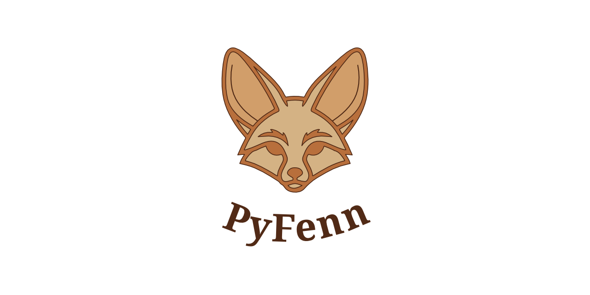

# fenn: Friendly Environment for Neural Networks

<p align="center"></p>

<div align="center">

  [](https://app.codacy.com/gh/blkdmr/fenn/dashboard?utm_source=gh&utm_medium=referral&utm_content=&utm_campaign=Badge_grade) [](https://codecov.io/gh/pyfenn/fenn)
  [](https://pypi.org/project/fenn/) [](https://discord.gg/WxDkvktBAa)

</div>

**Stop writing boilerplate. Start training.**

fenn is a lightweight Python framework that automates the "boring stuff" in Machine Learning projects. It handles configuration parsing, logging setup, and experiment tracking so you can focus on the model.


## Why fenn?

- **Auto-Configuration**: YAML files are automatically parsed and injected into your entrypoint with CLI override support. No more hardcoded hyperparameters or scattered config logic.

- **Unified Logging**: All logs, print statements, and experiment metadata are automatically captured to local files and remote tracking backends simultaneously with no manual setup required.

- **Multi-Backend Monitoring**: Native integration with industry-standard trackers like [Weights & Biases](https://wandb.ai/) (W&B) for centralized experiment tracking and [TensorBoard](https://www.tensorflow.org/tensorboard) for real-time metric visualization

- **Instant Notifications**: Get real-time alerts on **Discord** and **Telegram** when experiments start, complete, or fail—no polling or manual checks.

- **Template Ready**: Built-in support for reproducible, shareable experiment templates.

## Installation

```bash
pip install fenn
````

## Quickstart

### Initialize a Project

Run the CLI tool to download a template and config file:

```bash
fenn pull base
```

### Configuration

fenn relies on a simple YAML structure to define hyperparameters, paths, logging options, and integrations. You can configure the ``fenn.yaml`` file with the hyperparameters and options for your project.

The structure of the ``fenn.yaml`` file is:

```yaml
# ---------------------------------------
# Fenn Configuration (Modify Carefully)
# ---------------------------------------

project: base

# ---------------------------
# Logging & Tracking
# ---------------------------

logger:
  dir: logger

# ---------------------------------------
# Example of User Section
# ---------------------------------------

train:
    lr: 0.001
```

### Write Your Code

Use the `@app.entrypoint` decorator. Your configuration variables are automatically passed via `args`.

```python
from fenn import FENN

app = FENN()

@app.entrypoint
def main(args):
    # 'args' contains your fenn.yaml configurations
    print(f"Training with learning rate: {args['train']['lr']}")

    # Your logic here...

if __name__ == "__main__":
    app.run()
```

By default, fenn will look for a configuration file named `fenn.yaml` in the current directory. If you would like to use a different name, a different location, or have multiple configuration files for different configurations, you can call `set_config_file()` and update the path or the name of your configuration file. You must assign the filename before calling `run()`.

```python
app = FENN()
app.set_config_file("my_file.yaml")
...
app.run()
```

### Run It

```bash
python main.py
```

## Roadmap

- **ML Templates:** Automated creation of standard project structures.
- **Model Tools:** Utilities for Neural Network creation, training, and testing.
- **Notifications:** Email notification system for completed training runs.
- **Data Tools:** Data exploration and visualization helpers.
- **Analysis:** Result analysis tools (diagrams, confusion matrices, etc.).
- **Integrations:** Support for TensorBoard and similar tracking tools.
- **Testing:** Comprehensive unit and integration tests for the framework.

## Contributing

Contributions are welcome!

If you’re interested in helping, please feel free to join our [discord server](https://discord.gg/WxDkvktBAa) or the dedicated
[discussion page](https://github.com/blkdmr/fenn/discussions/11) and ping there your availability.

We can then discuss a possible contribution together, answer any questions, and help you get started!

**Please, before opening a pull request, consult our CONTRIBUTING.md**

Thank you for your support!